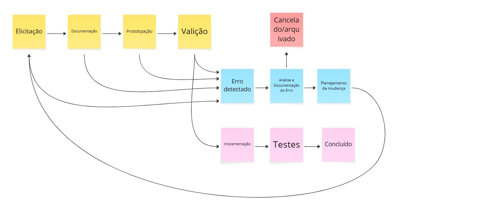

# Ciclo de Vida dos Requisitos

## Introdução
Este documento apresenta o **diagrama de estados do ciclo de vida dos requisitos** do projeto **<NOME DO PROJETO>**, elaborado com base nos conceitos estudados na disciplina de Engenharia de Requisitos.

O modelo foi inspirado na Figura 6.1 do livro *CPRE – Foundation Level*, porém adaptado à realidade do projeto e sem reprodução direta do modelo apresentado na obra.

---

## Visão Geral do Ciclo de Vida
O ciclo de vida definido adota uma abordagem iterativa, permitindo revisões, correções e mudanças nos requisitos sempre que necessário. O processo contempla desde a elicitação inicial até a conclusão, cancelamento ou reavaliação do requisito.

---

## Diagrama do Ciclo de Vida dos Requisitos

---

## Descrição dos Estados

### Elicitação
Fase inicial em que os requisitos são levantados junto aos stakeholders, por meio de entrevistas, reuniões ou análise do contexto do problema. O objetivo é compreender as necessidades do negócio e dos usuários.

### Documentação
Os requisitos elicitados são formalmente registrados, garantindo clareza, padronização e rastreabilidade ao longo do projeto.

### Prototipação
Os requisitos documentados são representados por meio de protótipos, possibilitando uma visualização prévia da solução e facilitando a identificação de falhas ou melhorias.

### Validação
Os requisitos são avaliados e validados junto aos stakeholders para verificar se atendem às necessidades levantadas. Caso inconsistências sejam identificadas, o requisito pode seguir para o estado de **Erro Detectado**.

### Erro Detectado
Estado em que são identificados erros, inconsistências ou necessidades de alteração nos requisitos, podendo ocorrer após qualquer etapa anterior do ciclo.

### Análise e Documentação do Erro
O erro detectado é analisado e documentado, permitindo compreender sua causa, impacto e possíveis soluções.

### Planejamento da Mudança
Nesta fase, é definido como a mudança será realizada, considerando impacto no escopo, custo e cronograma do projeto.

### Em Mudança
O requisito passa por alterações conforme o planejamento definido. Após as mudanças, ele pode retornar à fase de **Elicitação**, reiniciando o ciclo para nova análise e validação.

### Cancelado / Arquivado
Caso o requisito seja considerado inviável, desnecessário ou substituído, ele é cancelado ou arquivado, encerrando seu ciclo de vida.

### Implementação
Os requisitos aprovados seguem para a implementação, onde são desenvolvidos no sistema.

### Testes
Após a implementação, o requisito é testado para garantir que foi corretamente desenvolvido e atende à especificação definida.

### Concluído
O requisito é considerado concluído quando implementado e testado com sucesso, atendendo aos critérios definidos e às expectativas dos stakeholders.

# Estado atual de cada requisito

Requisitos Funcionais
| Código | Nome                            | Status       | Criticidade | Prioridade |
|--------|---------------------------------|--------------|-------------|------------|
| RF01   | Cadastro de usuários            | Documentação | Alta        | Alta       |
| RF02   | Autenticação de usuários        | Documentação | Alta        | Alta       |
| RF03   | Gestão de perfil                | Documentação | Média       | Média      |
| RF04   | Upload de mídias                | Documentação | Alta        | Alta       |
| RF05   | Gestão de catálogo              | Documentação | Alta        | Alta       |
| RF06   | Definição de preços e licenças  | Documentação | Alta        | Alta       |
| RF07   | Visualização de prévias         | Documentação | Média       | Média      |
| RF08   | Busca e filtros                 | Documentação | Alta        | Alta       |
| RF09   | Criação de álbuns               | Documentação | Média       | Média      |
| RF10   | Compra de mídias                | Documentação | Alta        | Alta       |
| RF11   | Download de conteúdos           | Documentação | Alta        | Alta       |
| RF12   | Histórico de compras            | Documentação | Média       | Média      |
| RF13   | Relatórios de vendas            | Documentação | Média       | Média      |
| RF14   | Comunicação entre usuários      | Documentação | Média       | Média      |
| RF15   | Gestão de eventos               | Documentação | Alta        | Alta       |
| RF16   | Credenciamento de fotógrafos    | Documentação | Alta        | Alta       |
| RF17   | Gestão de direitos de imagem    | Documentação | Alta        | Alta       |
| RF18   | Avaliação de conteúdos          | Documentação | Baixa       | Baixa      |
| RF19   | Moderação e remoção de conteúdo | Documentação | Alta        | Alta       |
| RF20   | Perfil de visualização pública  | Documentação | Média       | Média      |

Requisitos não Funcionais

| Código | Nome                           | Status       | Criticidade | Prioridade |
|--------|--------------------------------|--------------|-------------|------------|
| NF01   | Controle de acesso de usuários | Documentação | Alta        | Alta       |
| NF02   | Usabilidade e navegabilidade   | Documentação | Alta        | Alta       |
| NF03   | Conformidade legal             | Documentação | Alta        | Alta       |
| NF04   | Disponibilidade                | Documentação | Média       | Média      |
| NF05   | Desempenho                     | Documentação | Alta        | Alta       |
| NF06   | Escalabilidade                 | Documentação | Média       | Média      |
